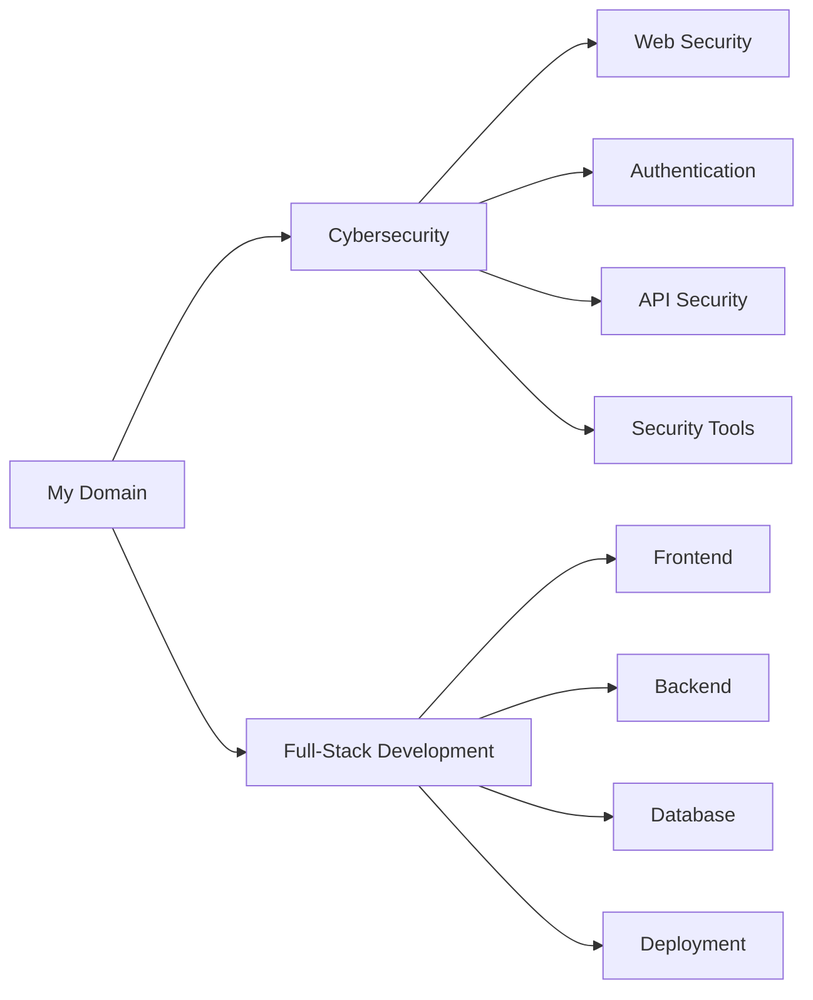
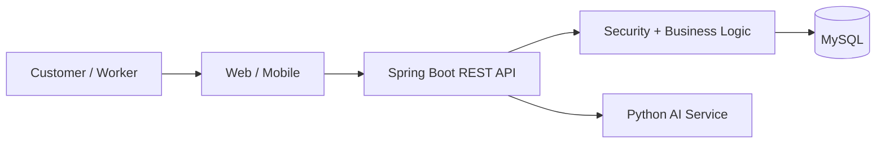
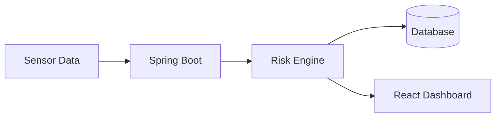
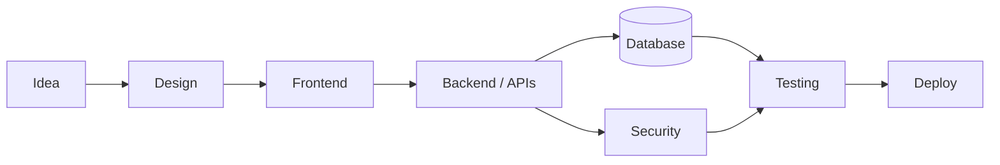

# 🚀 INJMAM ANSARI

### BCA Student · Cybersecurity Enthusiast · Full-Stack Web Developer

  
  
  

---

## 👋 About Me

I'm a **BCA student at Integral University, Lucknow** focused on building practical and secure software applications.

My main areas of interest are **Cybersecurity** and **Full-Stack Web Development**, with a strong focus on backend engineering, secure REST APIs, authentication, databases, and modern web applications.

- 🎓 BCA Student — Integral University, Lucknow
- 🔐 Focused on Cybersecurity & Secure Application Development
- 🌐 Building Full-Stack Web Applications
- ☕ Working with Java & Spring Boot
- ⚛️ Building interfaces with React & Next.js
- 🐍 Using Python for security tools and applied AI/ML
- 🗄️ Working with relational databases and ORM technologies
- 🚀 Learning through practical projects and real-world problem solving

---

## 🧩 My Development Focus

---

## 🛠️ Skills & Technologies

### 💻 Programming Languages

### ⚙️ Full-Stack Development

### 🔐 Cybersecurity

### 🗄️ Databases & Data

### 🤖 AI / ML & Tools

### ☁️ DevOps & Development Tools

---

## 🚀 Selected Projects

### 🤝 Cooperative Gig Services Platform
**Smart India Hackathon 2026 · Problem Statement 26089**

A full-stack cooperative service marketplace connecting customers, workers and cooperative services.

**Tech:** Java · Spring Boot · Spring Security · JWT · MySQL · Flutter · JavaScript · Python · FastAPI · AI/ML · Docker · WebSocket

**Focus:** Secure authentication · REST APIs · Booking workflows · Worker management · Notifications · AI-assisted demand intelligence

[💻 Source Code](https://github.com/injmam089/cooperative-gig-platform) · [🚀 Live Demo](https://cooperative-gig-platform.onrender.com)

---

### 🏔️ LANDSAFE
**IoT Landslide Early Warning & Monitoring Platform**

A prototype monitoring platform combining sensor-oriented data, risk analysis, backend APIs and a web dashboard.

**Tech:** Java · Spring Boot · React · MySQL · JWT · REST APIs · WebSocket

**Focus:** Monitoring dashboards · Risk calculation · Authentication · Real-time data · API-based architecture

[💻 Repository](https://github.com/injmam089/vishwakarma-2026)

---

### 🍽️ SAVOR
**Full-Stack Restaurant Platform**

Modern full-stack web application for restaurant ordering and management workflows.

**Tech:** Next.js · React · TypeScript · PostgreSQL · Prisma · NextAuth

**Focus:** Full-stack architecture · Database integration · Authentication · Modern UI

[💻 Source Code](https://github.com/injmam089/savor)

---

### 🛡️ Password Strength & Security Analyzer
**Cybersecurity Project**

A practical security tool that evaluates password characteristics and provides security-focused feedback.

**Tech:** Python · Tkinter · Password Analysis

**Focus:** Password security · Security rules · Input analysis · Secure password practices

---

### 🎯 Phishing Detection Tool
**Cybersecurity Project**

A web-based tool for analyzing URLs and identifying common phishing indicators.

**Tech:** Python · Flask · HTML · CSS · JavaScript

**Focus:** URL analysis · Web security · Risk indicators · Security awareness

---

### 🔎 Network Port Scanner & Vulnerability Reporter
**Cybersecurity Project**

A Python-based networking/security project for scanning ports and organizing basic security findings.

**Tech:** Python · Networking · Security Analysis

**Focus:** Port scanning · Network fundamentals · Security reporting

---

### 🌐 UniPortal
**University / Student Portal**

A university-focused web application for managing student-oriented portal functionality.

**Tech:** JavaScript · MySQL · HTML · CSS

[💻 Source Code](https://github.com/injmam089/UniPortal)

---

### 🏎️ CyberTorque-2D
**2D Desktop Racing Game**

A C++ desktop game built using Windows graphics APIs.

**Tech:** C++ · Win32 API · GDI+

[💻 Source Code](https://github.com/injmam089/CyberTorque-2D)

---

## 🔄 How I Build Applications

---

## 🧠 Engineering Focus

| Area | Skills |
|---|---|
| 🔐 **Cybersecurity** | Web Security · API Security · Authentication · Authorization · JWT · Password Security · Networking |
| ⚙️ **Backend** | Java · Spring Boot · Spring Security · REST APIs · JPA · Hibernate |
| 🎨 **Frontend** | HTML · CSS · JavaScript · TypeScript · React · Next.js |
| 🗄️ **Database** | MySQL · PostgreSQL · SQL · Prisma · Hibernate |
| 🤖 **AI / ML** | Python · FastAPI · Scikit-learn · Pandas · NumPy |
| ☁️ **DevOps** | Docker · Git · GitHub · Maven · Render · Vercel |
| 📱 **Mobile** | Flutter · Dart |

---

## 🎯 Current Focus

- 🔐 Deepening practical **Cybersecurity & Web Security**
- 🌐 Building secure **Full-Stack Web Applications**
- ⚙️ Improving **Spring Boot backend architecture**
- 🛡️ Learning secure authentication, authorization and API design
- 🧪 Building practical cybersecurity tools with Python
- 🗄️ Strengthening DBMS, SQL, OOP, DSA and system design fundamentals
- 🚀 Learning deployment, Docker and production-oriented development

---

## 📊 GitHub Activity

---

## 🎓 Education & Highlights

- 🎓 **BCA** — Integral University, Lucknow
- 🏆 **Smart India Hackathon 2026 Project** — Cooperative Gig Services Platform
- 💻 **Full-Stack Development** — Java, Spring Boot, React, Next.js, REST APIs & Databases
- 🔐 **Cybersecurity** — Web Security, Authentication, JWT & Secure API Development
- 🤖 **Applied AI/ML** — Python, FastAPI & Scikit-learn

---

## 🤝 Let's Connect

I'm interested in **Cybersecurity, Full-Stack Development, Secure APIs, Open Source and practical software engineering**.

### 💡 "Code. Learn. Build. Secure."

⭐ **Thanks for visiting my profile!**

